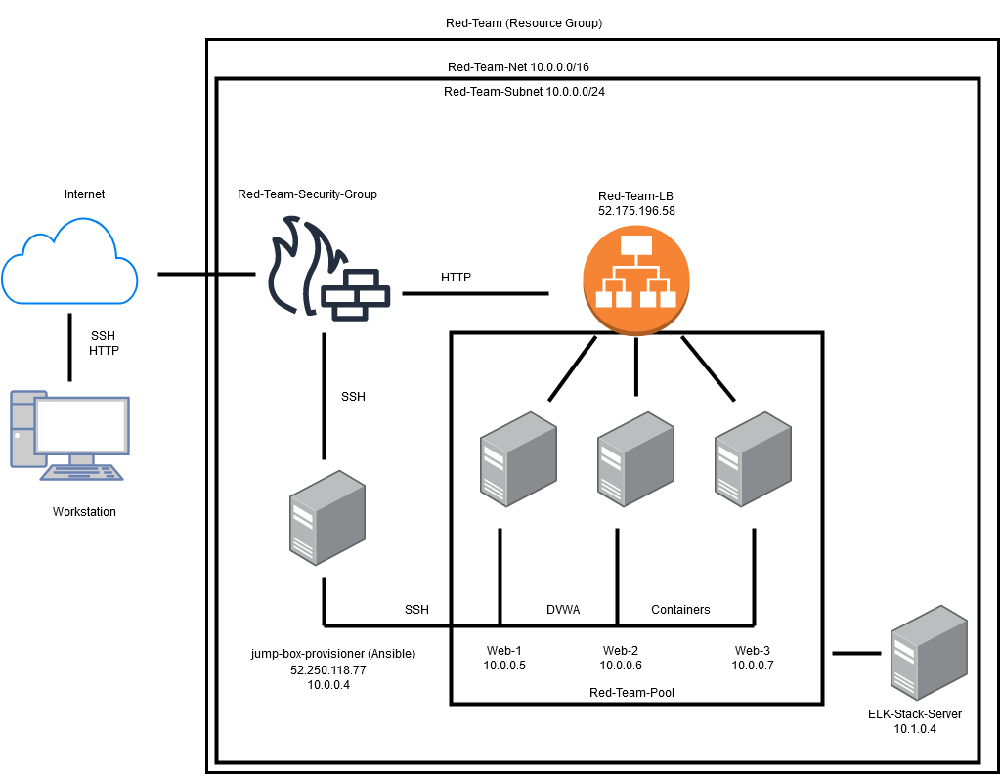
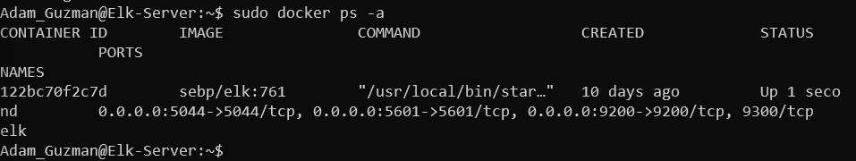

## Automated ELK Stack Deployment

The files in this repository were used to configure the network depicted below.

These files have been tested and used to generate a live ELK deployment on Azure. They can be used to either recreate the entire deployment pictured above. 

This document contains the following details:
- Description of the Topology
- Access Policies
- ELK Configuration
  - Beats in Use
  - Machines Being Monitored
- How to Use the Ansible Build

### Description of the Topology

The main purpose of this network is to expose a load-balanced and monitored instance of DVWA, the Damn Vulnerable Web Application.

Load balancing ensures that the application will be highly stable, in addition to restricting access to the network.

Integrating an ELK server allows users to easily monitor the vulnerable VMs for changes to the file systems of the devices on the network and system metrics.

The configuration details of each machine may be found below.

| Name     | Function | IP Address | Operating System |
|----------|----------|------------|------------------|
| Jump Box | Gateway  | 52.250.118.77   | Linux            |
| Web-1     |  Web Access        | 10.0.0.5           |Linux                   |
| Web-2    |    Web Access       |           10.0.0.6 |Linux                   |
| Web-3    |    Web Access       |   10.0.0.7         |Linux                   |
| ELK-Server  |  Security         | 10.1.0.4           |Linux                   |

### Access Policies

The machines on the internal network are not exposed to the public Internet. 

Only the Jump Box machine can accept connections from the Internet. Access to this machine is only allowed from the user's public IP addresses

Machines within the network can only be accessed from the Jump Box machine.

### Elk Configuration

Ansible was used to automate configuration of the ELK machine. No configuration was performed manually, which is much more effecient and leaves less room for human error, thus making it more secure.

The playbook implements the following tasks:
<li>
Use more memory
</li>
<li>
Install docker.io
</li>
<li>
Install pip3
</li>
<li>
Install the Docker python module
</li>
<li>
Download and launch the docker ELK container
</li>
&nbsp;

The following screenshot displays the result of running `docker ps` after successfully configuring the ELK instance.

### Target Machines & Beats
This ELK server is configured to monitor the Web-1, Web-2, and Wev-3 DVWA VMs, listed at 10.0.0.5, 10.0.0.6, and 10.0.0.7 respectively.

We have installed the following Beats on these machines:
<li>
Filebeat</li>
<li>Metricbeat</li>

These Beats allow us to collect the following information from each machine:
<li>
Filebeat: detects any changes made to the filesystem</li>
<li>Metricbeat: detects changes in system metrics (i.e. CPU/RAM usage)  </li>  
&nbsp;

### Using the Playbook
In order to use the playbook, you will need to have an Ansible control node already configured. In this project, the Jump Box serves this purpose: 

SSH into the Jump Box and follow the steps below:
- Copy the playbooks to the /etc/ansible directory.
- Run the playbook on the corresponding virtual machines. 